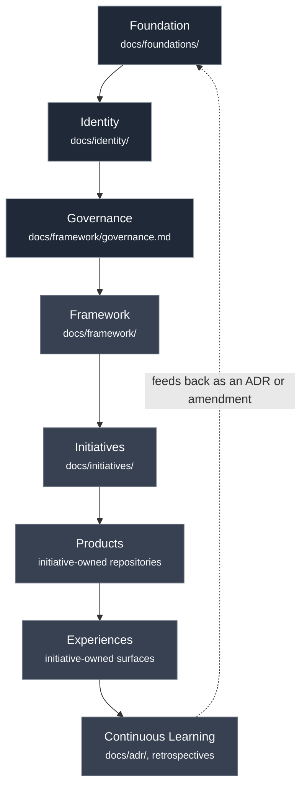
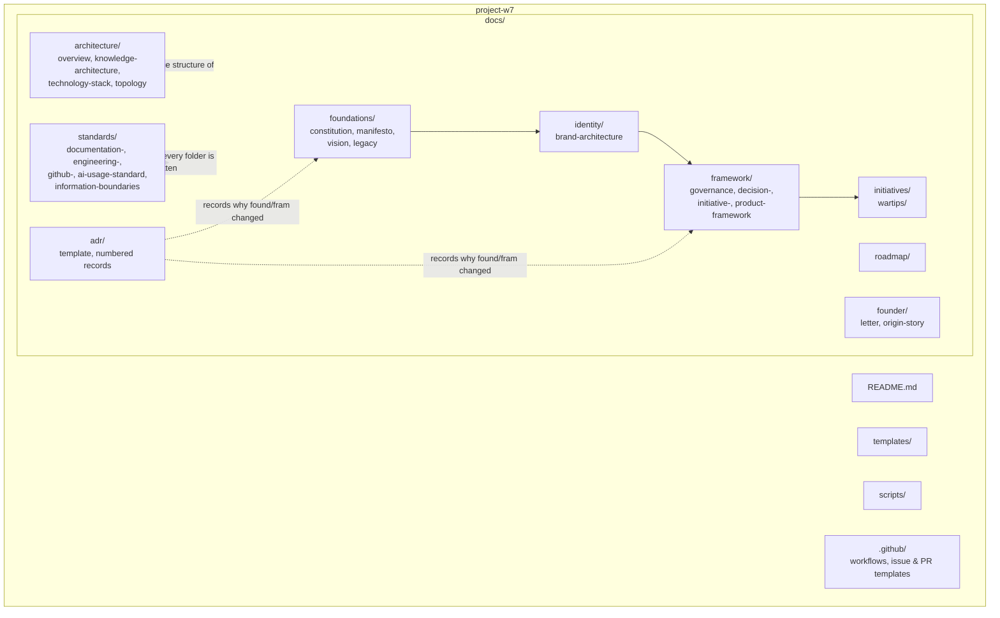
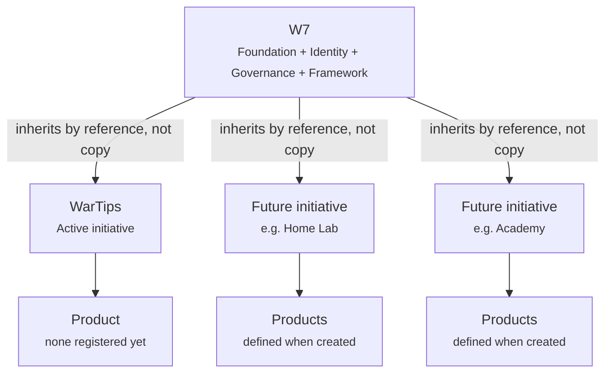
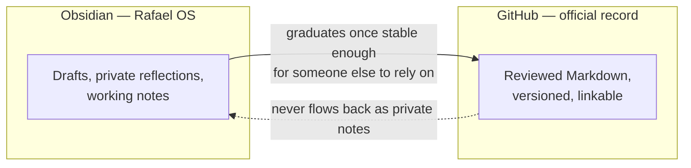

# Ecosystem Topology

Version: 1.1.0

Status: Active

Owner: Rafael da Silva Guerra

---

## Purpose

This document is a visual complement to [Architecture Overview](overview.md): the same layer model, repository structure and initiative inheritance rules, expressed as diagrams instead of tables and prose.

---

## Context

The Architecture Overview explains the layer model in words. Some relationships — especially inheritance and the feedback loop back into the Foundation — are easier to verify correct as a diagram than as a table. This document exists so that "does this change respect the topology?" can be checked visually, not just argued in text.

---

## Layer Model

Dependencies only ever point downward (solid arrows). The only upward path is the dotted feedback loop — a lesson learned at any layer becomes an ADR, and only a deliberate, reviewed ADR is allowed to change the Foundation. See [Decision Framework](../framework/decision-framework.md).

---

## Repository Structure

Folder placement is not cosmetic — it is the mechanism that enforces the layer model in the previous diagram. A document in the wrong folder implies the wrong dependency direction. See [ADR-0002](../adr/0002-layered-repository-architecture.md).

---

## Initiative Inheritance

Every initiative points back to exactly one W7. No initiative points to another initiative — cross-initiative dependencies are deliberately not part of this topology. If one is ever needed, it is a Type 2/3 decision under the [Decision Framework](../framework/decision-framework.md), not an informal link between two `docs/initiatives/` folders.

---

## Knowledge Boundary

This is a one-way graduation, never a sync. See [Information Boundaries](../standards/information-boundaries.md).

---

## Related Documents

- [Architecture Overview](overview.md) — the prose version of the layer model diagrammed above
- [Knowledge Architecture](knowledge-architecture.md) — the reasoning behind the knowledge boundary diagram
- [ADR-0002: Layered Repository Architecture](../adr/0002-layered-repository-architecture.md) — why the repository is shaped this way
- [Initiative Framework](../framework/initiative-framework.md) — the process behind the inheritance diagram
