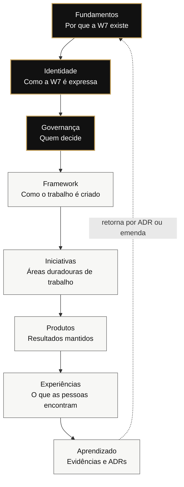
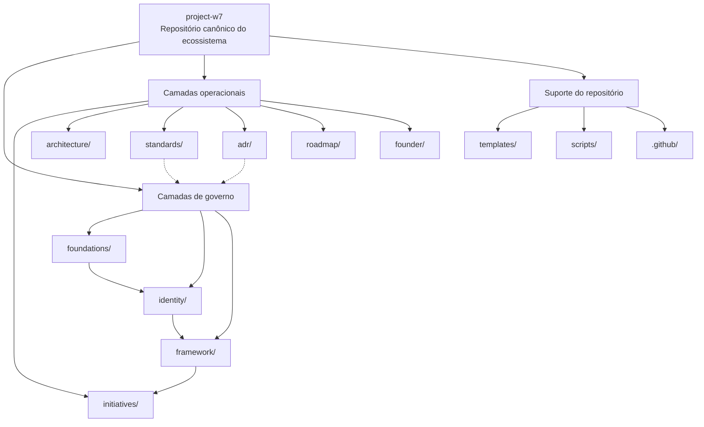
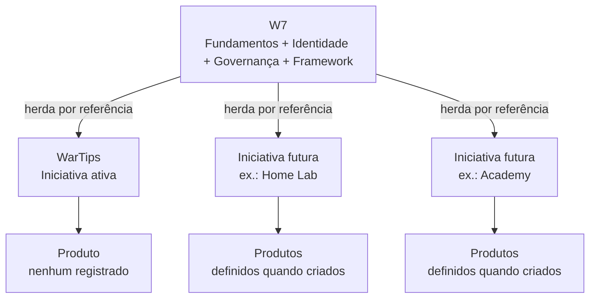
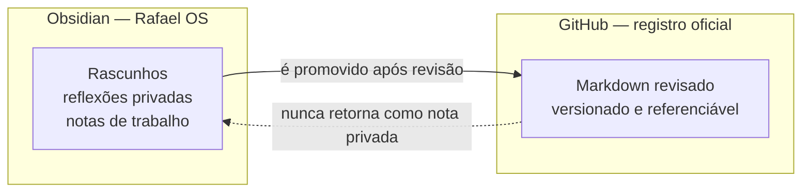

# Topologias do Ecossistema

Version: 1.2.0

Status: Active

Owner: Rafael da Silva Guerra

---

## Propósito

Este documento complementa visualmente a [Visão Geral da Arquitetura](overview.md): o mesmo modelo de camadas, estrutura de repositório, herança de iniciativas e limite de conhecimento apresentados como diagramas.

---

## Contexto

Relacionamentos como herança e o retorno do aprendizado aos Fundamentos são mais fáceis de conferir visualmente. Os diagramas podem ser rolados horizontalmente e ampliados com um clique.

---

## Modelo de Camadas

As setas sólidas mostram a direção da dependência. O único caminho de retorno é o aprendizado: uma lição se transforma em ADR e somente uma decisão deliberada pode alterar os Fundamentos.

## Framework do Repositório

O local de cada documento expressa sua dependência e seu alcance. Colocá-lo na pasta errada significa atribuir autoridade à camada errada.

## Herança das Iniciativas

Cada iniciativa aponta para uma única W7. Iniciativas não dependem informalmente umas das outras; uma necessidade desse tipo passa pelo Framework de Decisão.

## Limite do Conhecimento

Essa é uma promoção em uma única direção, nunca uma sincronização.

---

## Documentos Relacionados

- [Visão Geral da Arquitetura](overview.md) — versão textual do modelo
- [Arquitetura do Conhecimento](knowledge-architecture.md) — raciocínio por trás do limite do conhecimento
- [ADR-0002](../adr/0002-layered-repository-architecture.md) — decisão sobre a arquitetura em camadas
- [Framework de Iniciativas](../framework/initiative-framework.md) — processo por trás da herança
